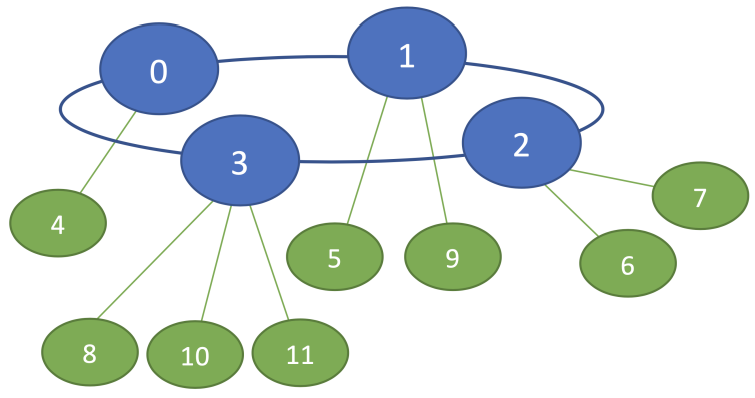
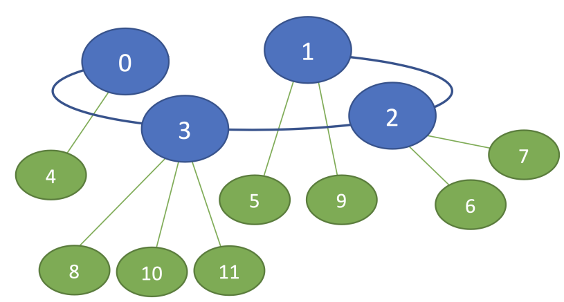
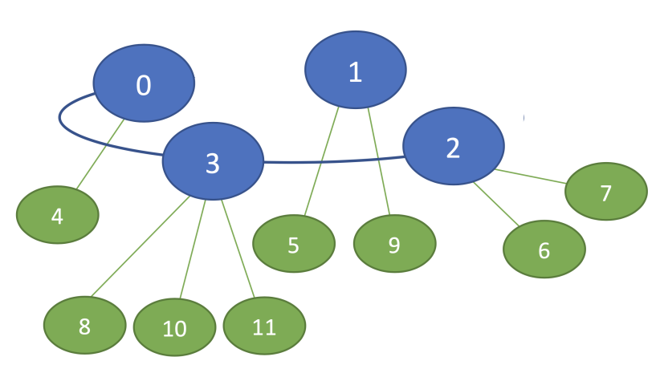

# Calcule colaborative in sisteme distribuite OpenMPI
Responsabili: Elena Apostol, Radu-Ioan Ciobanu
## Descriere
Acesta este un program distribuit in MPI in care procesele sunt grupate intr-o topologie formata din patru clustere, fiecare din acestea avand cate un coordonator si cate un numar arbitrar de procese worker. Procesele worker dintr-un cluster pot sa comunice doar cu coordonatorul lor, iar cei patru coordonatori pot sa comunice intre ei intr-o topologie de tip inel pentru a conecta clusterele.

Scopul este ca toate procesele worker sa ajunga sa lucreze impreuna, cu ajutorul coordonatorilor, pentru rezolvarea unor task-uri computationale. Acest lucru se va realiza prin stabilirea topologiei si diseminarea ei catre toate procesele, si apoi prin impartirea calculelor in mod cat mai echilibrat intre workeri.
### Stabilirea topologiei

Sistemul distribuit implementat este format din patru clustere cu cate un numar arbitrar de procese worker, asa cum se poate observa in exemplul din figura de mai jos. Fiecare proces cunoaste faptul ca sunt patru clustere inca de la inceputul rularii programului.



Coordonatorii sunt procesele cu rangurile 0, 1, 2, 3 (acest lucru fiind cunoscut din start de catre toti coordonatorii). Fiecare coordonator este responsabil de propriile sale procese worker, asa cum se poate observa in figura de mai sus (unde fiecare linie dintre doua procese reprezinta un canal de comunicatie).
La inceputul executiei programului distribuit, procesele coordonator vor citi informatii despre procesele din clusterele lor din patru fisiere de intrare (cate unul pentru fiecare coordonator), numite cluster0.txt, cluster1.txt, cluster2.txt si cluster3.txt. Pentru topologia prezentata in figura de mai sus, cele patru fisiere de intrare vor arata astfel:
```
$ cat cluster0.txt 
1 
4 
$ cat cluster1.txt 
2 
5
9 
$ cat cluster2.txt 
2 
6 
7 
$ cat cluster3.txt 
3 
8 
10 
11
```
In exemplele de mai sus, prima linie reprezinta numarul de procese worker dintr-un cluster, iar urmatoarele linii contin rangurile workerilor.
Fiecare mesaj trimis trebuie logat in urmatorul format ``` M(sursa, destinatia)```.
Coordonatorii le comunica workerilor de care sunt responsabili rangul lor. 
Fiecare proces din topologie trebuie sa cunoasca topologia completa, de aceea coordonatorii trebuie sa comunice intre ei ca sa completeze topologia ca dupa sa o distribuie.
In momentul in care un proces are topologia finala, va trebui sa o afiseze in terminal, de exemplu, procesul 1 afiseaza topologia (care e cea din exemplul de mai sus):
```1 -> 0:4 1:5,9 2:6,7 3:8,10,11```

### Realizarea calculelor
Odata ce toate procesele cunosc topologia, urmeaza partea de calcule, care este coordonata de catre procesul 0. Mai concret, procesul 0 va genera un vector V de dimensiune N (unde N este primit ca parametru la rularea programului si este initial cunoscut doar de catre procesul 0), unde V[K] = N - K - 1 (cu K intre 0 si N - 1), care trebuie inmultit cu 5 element cu element. Inmultirea cu 5 a elementelor vectorului este realizata doar de catre procesele worker, deci procesele coordonator vor imparti calculele in mod cat mai echilibrat la procesele worker.
Odata ce procesul 0 genereaza vectorul, va distribui mai departe calculele catre clusterul sau si catre celelalte trei clustere, prin intermediul coordonatorilor. Cand calculele sunt finalizate, vectorul rezultat trebuie reasamblat la procesul 0 si afisat de catre acesta. Un exemplu de afisare poate fi observat mai jos, pentru un vector de dimensiune 12:
```Rezultat: 55 50 45 40 35 30 25 20 15 10 5 0```
### Defecte de comunicatie
Programul trebuie sa functioneze si in cazul existentei unui defect de comunicatiei (unde in cazul acestui program, poate exista doar intre procesele 0 si 1). Mai precis, legatura dintre cele doua procese dispare, asa cum se poate observa in imaginea de mai jos (unde avem aceeasi structura a sistemului distribuit prezentata anterior).



### Partitionare
Programul deasemenea, trateaza si un caz de partitionare a unui cluster. Mai precis, procesul 1 ajunge sa fie deconectat de procesele 0 si 2, deci el nu mai poate fi accesat din orice alt coordonator. Astfel, avem o partitionare a sistemului, ceea ce inseamna ca procesul 1 si workerii sai nu mai pot fi utilizati in realizarea calculelor, asa cum se poate observa in imaginea de mai jos (unde avem aceeasi structura a sistemului distribuit prezentata anterior).



Astfel, un proces din partitia mare va afisa topologia pe care o cunoaste in cadrul partitiei sale:
```4 -> 0:4 2:6,7 3:8,10,11```
Un proces din partitia mica va afisa urmatorul mesaj:
```5 -> 1:5,9```

## Executie si build
- Fisierele de intrare pentru fiecare clustere (coordonatori) trebuie sa fie in radacina cu fisierul executabil
- Build se face cu ```$ make```
- Rulare: ```$ mpirun --oversubscribe -np <numar_procese> ./tema3 <dimensiune_vector> <eroare_de_comunicatie>```
- Al doilea parametru dat la rulare va fi 0 daca legatura dintre procesele 0 si 1 exista (nu are loc o eroare pe canalul de comunicati), 1 daca procesele 0 si 1 nu pot comunica direct, sau 2 daca are loc o partitie si coordonatorul 1 este izolat.
**Atentie!** Se presupune ca datele de intrare sunt intotdeauna corecte.
- Sunt disponibile niste teste, in directorul tests
- Pentru a rula checkerul pentru testele propuse se poate folosi ```$ ./checker.sh``` din directorul checker

## Copyright
Drepturile asupra enuntului temei, testelor propuse si checker-ului apartin echipei APD, facultatea ACS, UPB 2022-2023.